<div align="center">


<h1>Azure Virtual Desktop (AVD) Security Baseline</h1>

<p><strong>Hardened, Zero-Trust, Policy-Driven & Continuously Validated Security Foundation</strong></p>

[](https://devopstrio.co.uk/)
[](https://devopstrio.co.uk/)
[](https://devopstrio.co.uk/)
[](/apps/policy-engine)

</div>

---

## 🏛️ Executive Summary

The **AVD Security Baseline** is a flagship enterprise cyber foundation designed to deliver an uncompromising "Secure-by-Default" posture for Azure Virtual Desktop (AVD) environments. In a globalized, remote-first workforce, the virtual desktop is often the primary gateway to corporate intellectual property. This platform ensures that every session, identity, and endpoint is hardened to **CIS & NIST standards**, with zero-trust architectural guardrails that prevent lateral movement and data exfiltration.

By integrating high-performance **Policy & Hardening Engines**, the platform continuously audits and remediates security drift across the AVD estate. From Entra ID Conditional Access rings to Windows 11 OS hardening and Layer 7 firewall enforcements, the Security Baseline provides CISO-level visibility and control via a premium command center dashboard, ensuring audit-readiness and executive confidence at global scale.

### Strategic Business Outcomes
- **Uncompromising Zero-Trust Security**: Implement "Assume-Breach" logic across the entire desktop fleet, enforcing MFA, least-privilege, and micro-segmentation.
- **Automated Compliance Readiness**: Maintain a continuous state of audit-preparedness for ISO27001, SOC2, and CIS benchmarks through automated evidence collection and drift correction.
- **Hardened Endpoint Foundations**: Eliminate attack vectors on the OS level through automated Windows 11 multi-session hardening, Defender orchestration, and patch integrity checks.
- **Cyber Resilience & Threat Visibility**: Ingest real-time signals from Microsoft Sentinel and Defender for Cloud to visualize threats, detect anomalous session behavior, and remediate risks instantly.

---

## 🏗️ Technical Architecture Details

### 1. High-Level Security Architecture
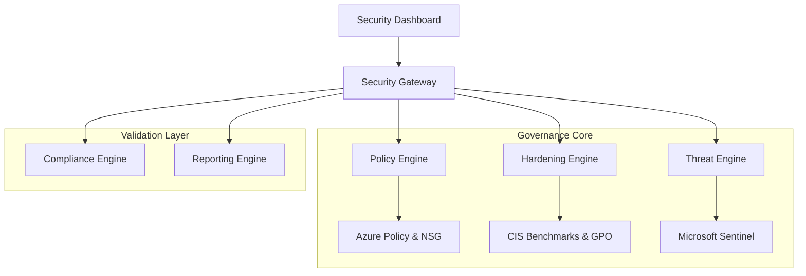

### 2. Policy Enforcement Workflow
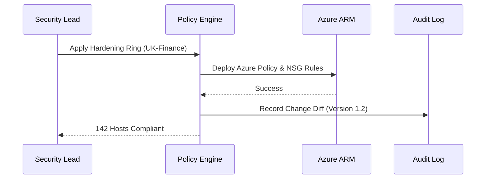

### 3. Hardening Lifecycle
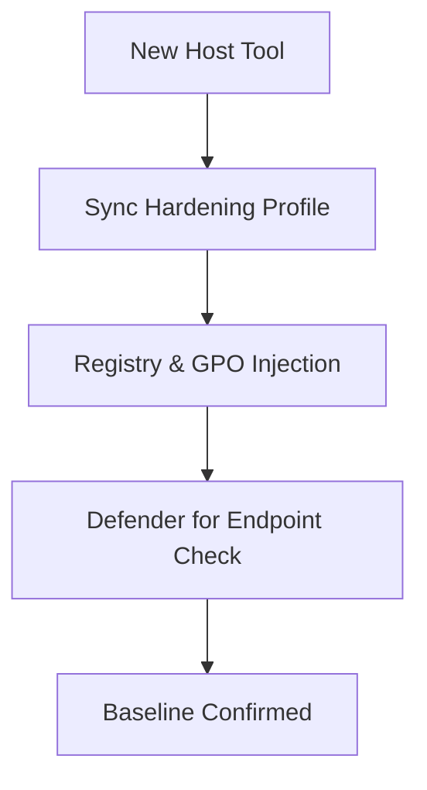

### 4. Threat Detection Flow
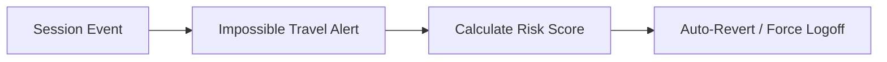

### 5. Identity Review Workflow
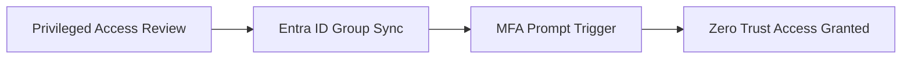

### 6. Security Trust Boundary
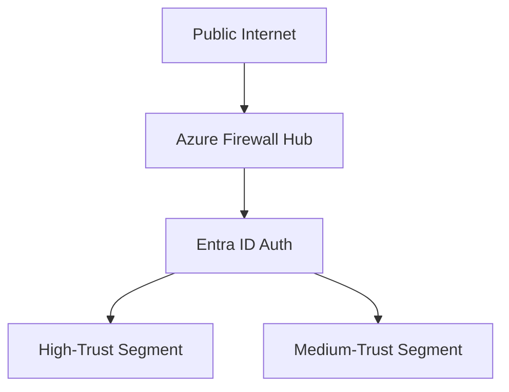

### 7. AVD Global Topology
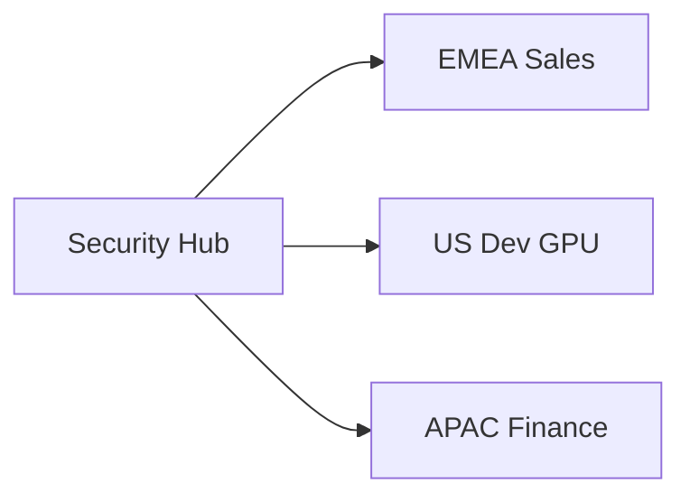

### 8. API Request Lifecycle
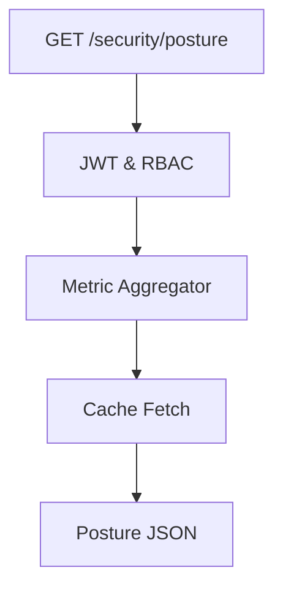

### 9. Multi-Tenant Tenancy Model
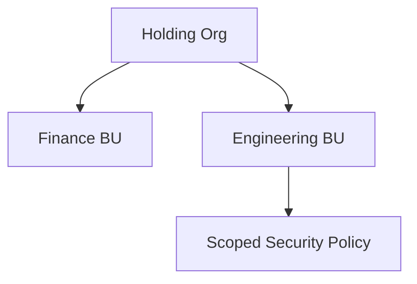

### 10. Monitoring & Telemetry Flow
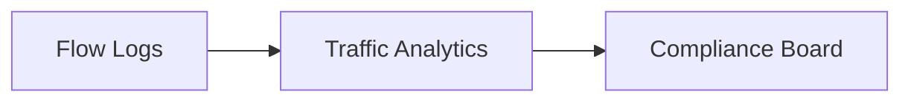

### 11. Disaster Recovery Topology
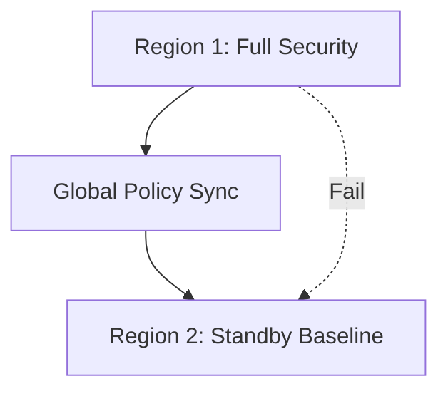

### 12. Audit Evidence Workflow
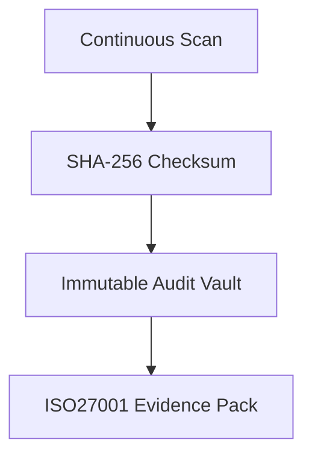

### 13. Identity Federation Model
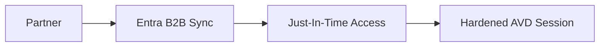

### 14. Break-Glass Control Flow
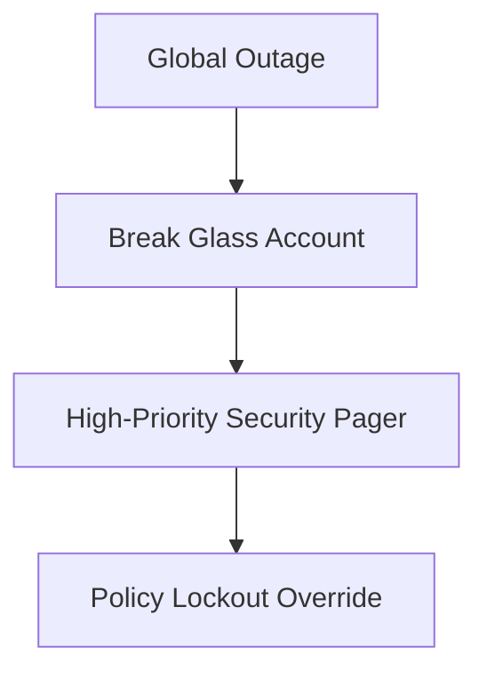

### 15. CI/CD Infrastructure Pipeline
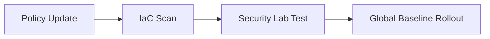

### 16. Executive Governance Workflow
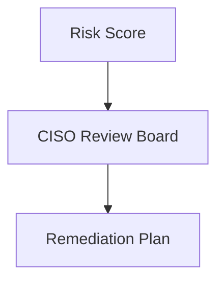

### 17. Drift Remediation Lifecycle
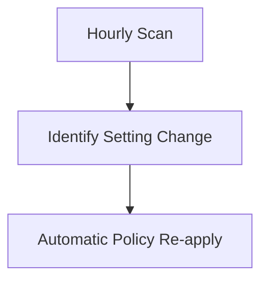

### 18. Regional Secure Topology
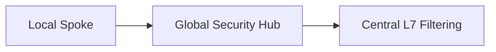

### 19. Global Region Topology
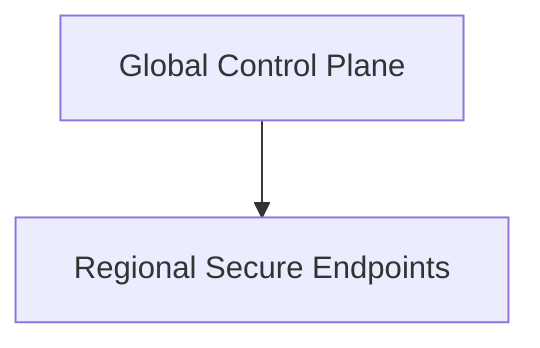

### 20. Continuous Compliance Model
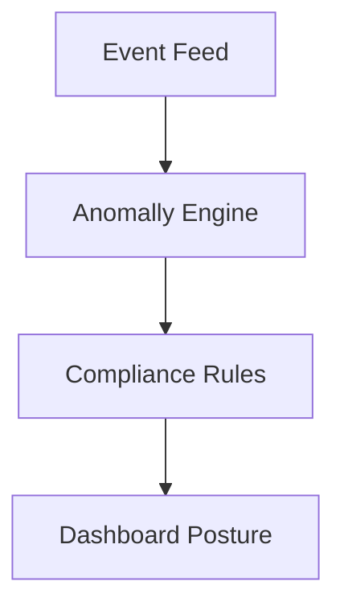

---

## 🚀 Deployment Guide

### Terraform Global Rollout
```bash
cd terraform/environments/prd
terraform init
terraform apply -auto-approve
```

---
<sub>&copy; 2026 Devopstrio &mdash; Engineering the Hardened Foundation for the Global Digital Workplace.</sub>
