<div align="center">


<h1>AVD Security Baseline</h1>

<p><strong>The Institutional-Grade Platform for Standardized Security Foundations, Zero-Trust Governance, and Multi-Cloud EUC Ecosystems.</strong></p>

[]()
[]()
[]()

<br/>

> **"Industrializing security hardening to automate digital workplace foundations."** 
> **AVD Security Baseline** is an enterprise-grade platform designed to provide a secure, measurable, and highly automated foundation for global virtual desktop operations. It orchestrates the complex lifecycle of security—from automated policy enforcement and multi-cloud hardening reconciliation to high-throughput threat intelligence and unified EUC auditing.

</div>

---

## 🏛️ Executive Summary

Fragmented security baselines and manual hardening orchestration are strategic operational liabilities; lack of a standardized security framework is a primary barrier to organizational engineering maturity. Organizations fail to secure their virtual desktops not because of a lack of tools, but because of fragmented evaluation standards, lack of automated policy reconciliation, and an inability to orchestrate security planes with operational precision.

This platform provides the **Security Intelligence Plane**. It implements a complete **AVD-Security-Baseline-as-Code Framework**, enabling CISO teams and Security Architects to manage global security foundations as first-class citizens. By automating the identification of architectural regressions through real-time telemetry analysis and orchestrating the provisioning of secure performance-driven security policies, we ensure that every organizational session—from core host pools to edge contractor clusters—is secured by default, audited for history, and strictly aligned with institutional EUC frameworks.

---

## 📐 Architecture Storytelling: Principal Reference Models

### 1. Principal Architecture: Global Security Hub & Intelligence Plane
This diagram illustrates the high-level relationship between the Security Dashboard, the Policy & Hardening Engines, and the underlying Governance Core (Azure Policy, CIS Benchmarks, Sentinel). It defines the bridge between virtual sessions and the hardened security substrate.

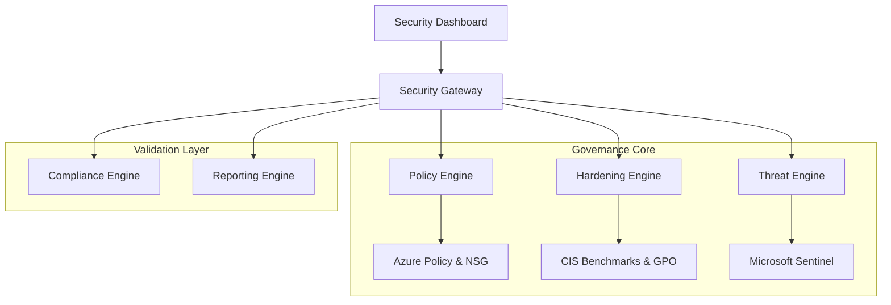

### 2. The Security Lifecycle Flow (Policy & Hardening)
The continuous path of a security setting from initial hardening ring application and GPO injection to real-time policy enforcement and versioned audit log recording. This ensures zero-interruption operations through dependency-aware security flows.

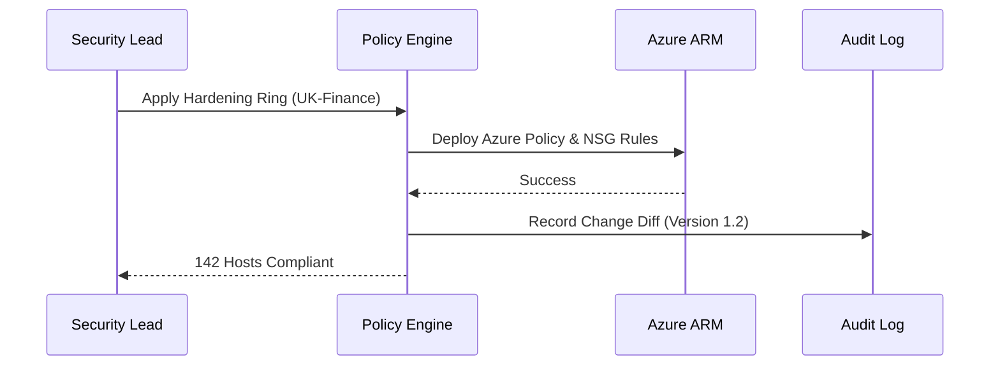

**Hardening Lifecycle:**
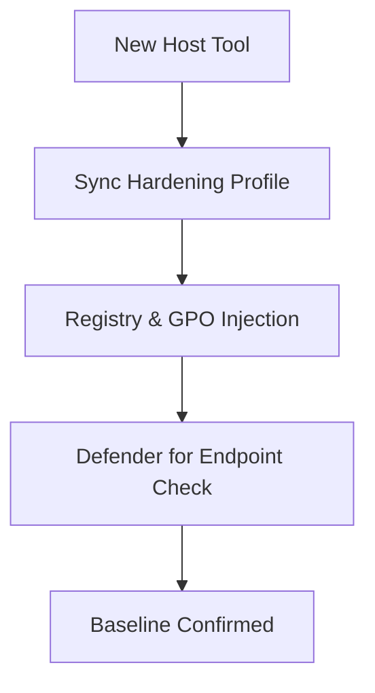

### 3. Distributed Security Topology (Global Hub & Spokes)
Strategically orchestrating standardized security across global regions (EMEA, US, APAC) and diverse resource segments, providing a unified institutional view of security readiness.

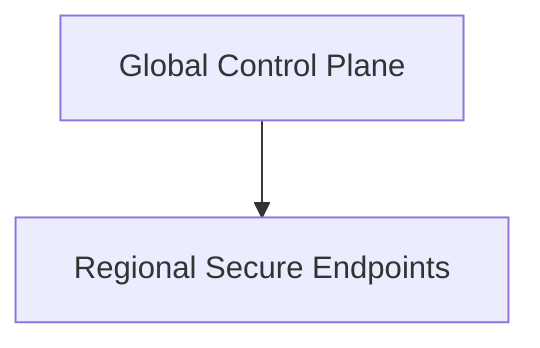

**AVD Global Topology:**
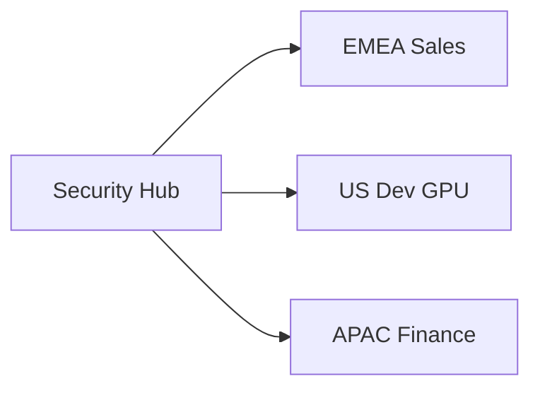

**Regional Secure Topology:**
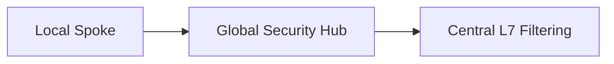

### 4. Governance Hub & Control Plane Flow
Executing complex logic for securing the bridge between security requests and Azure resources, ensuring every request is authorized, metrics are aggregated, and executive oversight is maintained.

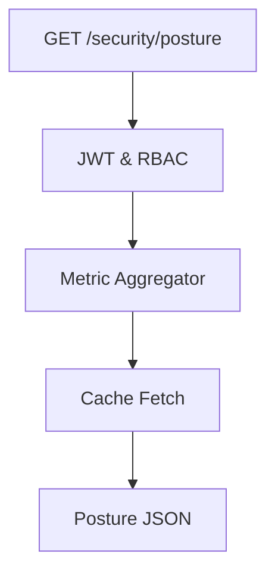

**Executive Governance Workflow:**
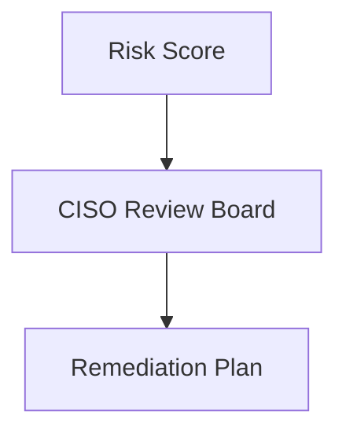

### 5. Multi-Cloud Security Federation & Global Topology
Automatically managing unified security standards across diverse cloud tenants and global regions, ensuring institutional data residency and privacy boundaries by default.

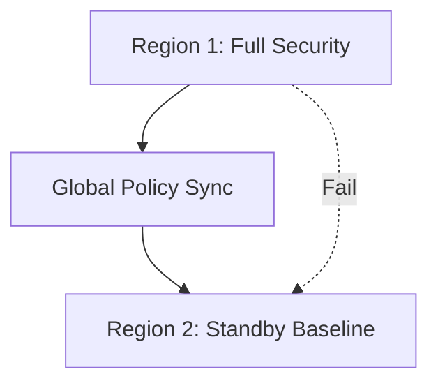

### 6. Encryption & Perimeter Protection Flow (Security Trust Boundary)
Managing the lifecycle of a security request, automatically enforcing institutional Conditional Access and MFA standards as required by security policy, ensuring zero-latency security confidence.

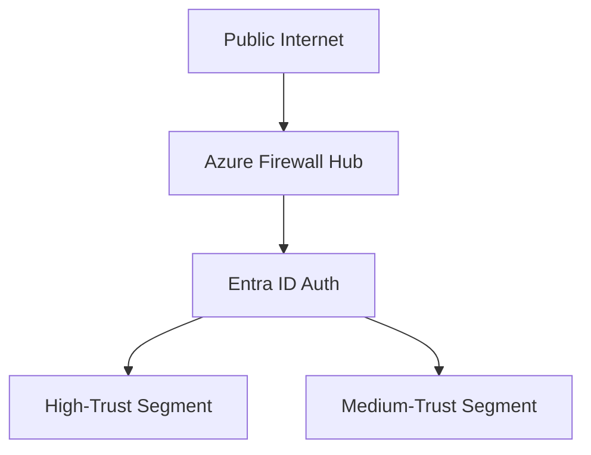

### 7. Institutional Security Maturity Scorecard (Compliance Model)
Grading organizational performance based on key indicators: Risk Scores, Compliance Posture, and Security Adoption Scores across all business units.

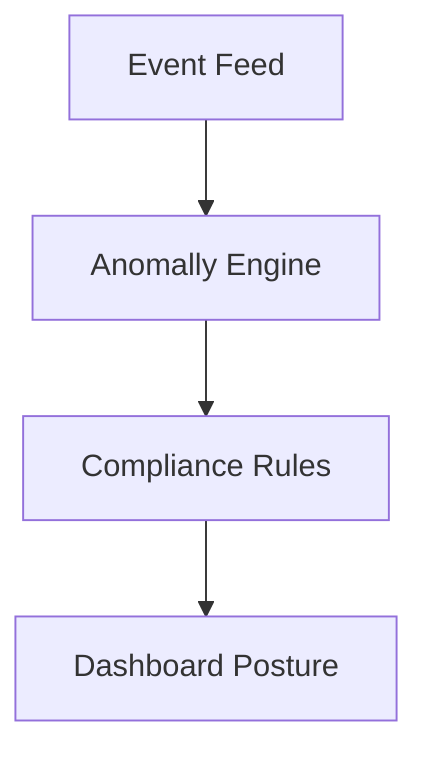

### 8. Identity & RBAC for Security Governance
Managing fine-grained access to security hubs, provisioning workers, and audit logs between Global Holding Companies and Business Unit identities.

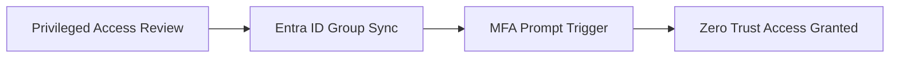

**Identity Federation Model:**
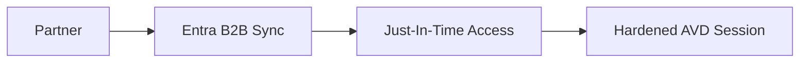

**Multi-Tenant Tenancy Model:**
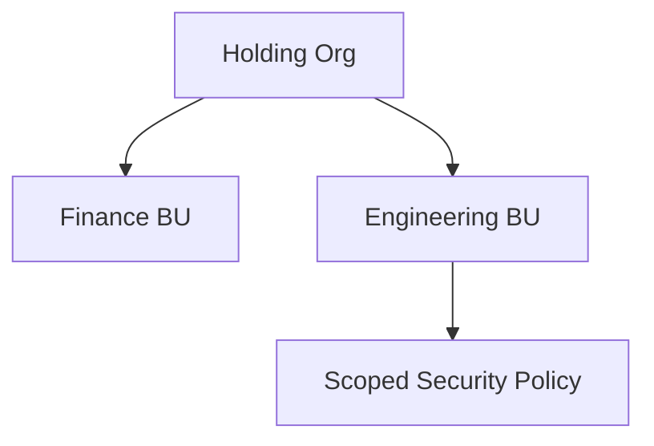

### 9. IaC Deployment: AVD-Security-Baseline-as-Code Framework
Using modular CI/CD pipelines to deploy and manage the versioned distribution of the security baselines, IaC scans, and validation fleets.

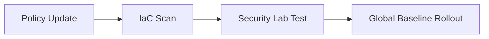

### 10. AIOps Security Drift & Risk Validation Flow
Using advanced analytics to identify sudden surges in identity risks, unauthorized policy changes, or unusual delivery pattern changes that could result in institutional risk or downtime.

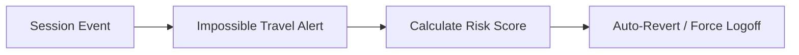

**Drift Remediation Lifecycle:**
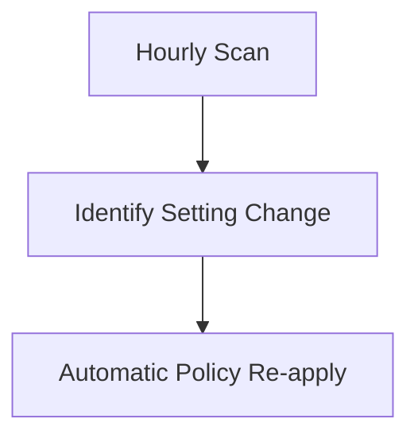

**Break-Glass Control Flow:**
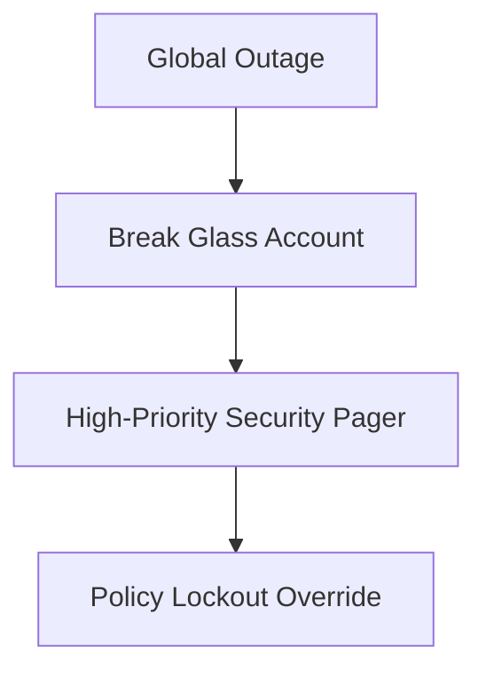

### 11. Metadata Lake for Forensic Security Audit
Storing long-term records of every security integration event (metadata), every identity review executed, and every flow log telemetry for institutional record-keeping and forensic analysis.

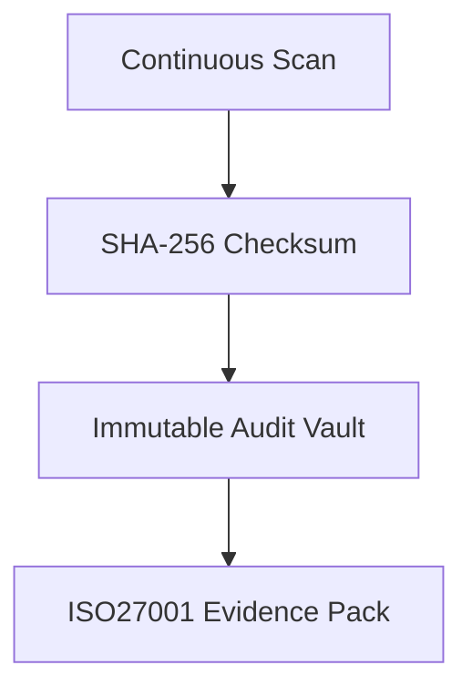

**Monitoring & Telemetry Flow:**
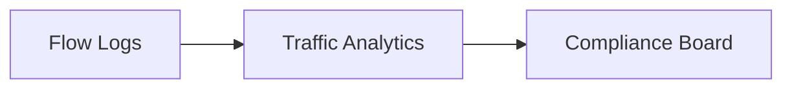

---

## 🏛️ Core Governance Pillars

1.  **Unified Foundation Coordination**: Maximizing resilience by centralizing all security measurement through a single institutional plane.
2.  **Automated Security Provisioning**: Eliminating "manual tracking" scenarios through proactive orchestration and pattern verification.
3.  **Sequential Security Intelligence**: Ensuring zero-interruption operations through dependency-aware security-driven data engineering.
4.  **Zero-Trust Identity Protection**: Automatically enforcing identity-based access, flow encryption, and policy evaluation across all assurance tiers.
5.  **Autonomous Operations Logic**: Guaranteeing reliability through automated industry-specific effectiveness monitoring runbooks.
6.  **Full Security Auditability**: Immutable recording of every security change and baseline provision for institutional forensics.

---

## 🛠️ Technical Stack & Implementation

### Security Engine & APIs
*   **Framework**: Python 3.11+ / FastAPI.
*   **Performance Engine**: Custom Python-based logic for multi-cloud security reconciliation and DORA-style EUC metrics.
*   **Integrations**: Native connectors for Azure Policy, Microsoft Entra ID, Sentinel, and Defender for Cloud.
*   **Persistence**: PostgreSQL (Security Ledger) and Redis (Live Compliance State).
*   **Auth Orchestrator**: Federated OIDC/SAML for least-privilege security management access.

### Governance Dashboard (UI)
*   **Framework**: React 18 / Vite.
*   **Theme**: Dark, Slate, Indigo (Modern high-fidelity productivity aesthetic).
*   **Visualization**: D3.js for delivery topologies and Recharts for ROI velocity analytics.

### Infrastructure & DevOps
*   **Runtime**: AWS EKS or Azure Kubernetes Service (AKS) for management plane.
*   **Measurement Hub**: Managed event sourcing for immutable productivity timeline reconstruction.
*   **IaC**: Modular Terraform for deploying the security landing zone and validation fleet.

---

## 🏗️ IaC Mapping (Module Structure)

| Module | Purpose | Real Services |
| :--- | :--- | :--- |
| **`infrastructure/security_hub`** | Central management plane | EKS, PostgreSQL, Redis |
| **`infrastructure/enforcers`** | Distributed policy provisioners | Azure, AWS, GCP APIs |
| **`infrastructure/security_pipes`** | Data Ingestion Hubs | Webhooks, Lambda |
| **`infrastructure/auditing`** | Forensic modernization sinks | S3, Athena, Quicksight |

---

## 🚀 Deployment Guide

### Local Principal Environment
```bash
# Clone the AVD Security Baseline repository
git clone https://github.com/devopstrio/avd-security-baseline.git
cd avd-security-baseline

# Configure environment
cp .env.example .env

# Launch the Security stack
make init

# Trigger a mock security update and automated guardrail validation simulation
make simulate-security
```

Access the Management Portal at `http://localhost:3000`.

---

## 📜 License
Distributed under the MIT License. See `LICENSE` for more information.

---
<div align="center">
  <p>© 2026 Devopstrio. All rights reserved.</p>
</div>
